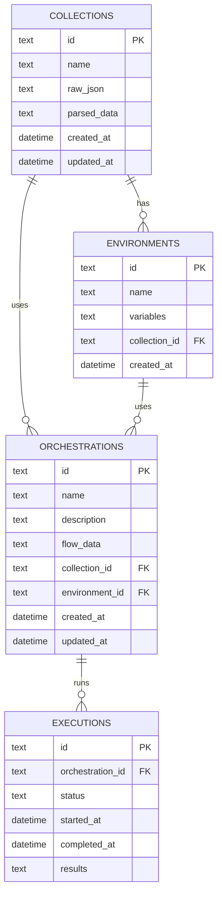

# APIMason — Database Schema (SQLite)

## ER Diagram



## SQL Definitions

```sql
-- Collections imported from Postman
CREATE TABLE collections (
  id            TEXT PRIMARY KEY,
  name          TEXT NOT NULL,
  raw_json      TEXT NOT NULL,      -- original Postman JSON (v2.0 or v2.1)
  parsed_data   TEXT NOT NULL,      -- structured parse result (normalised)
  created_at    DATETIME DEFAULT CURRENT_TIMESTAMP,
  updated_at    DATETIME DEFAULT CURRENT_TIMESTAMP
);

-- Environments imported from Postman
CREATE TABLE environments (
  id            TEXT PRIMARY KEY,
  name          TEXT NOT NULL,
  variables     TEXT NOT NULL,      -- JSON key-value pairs
  collection_id TEXT REFERENCES collections(id) ON DELETE CASCADE,
  created_at    DATETIME DEFAULT CURRENT_TIMESTAMP
);

-- User-created orchestrations (flows)
CREATE TABLE orchestrations (
  id              TEXT PRIMARY KEY,
  name            TEXT NOT NULL,
  description     TEXT,
  flow_data       TEXT NOT NULL,    -- React Flow JSON (nodes + edges + block configs)
  collection_id   TEXT REFERENCES collections(id) ON DELETE SET NULL,
  environment_id  TEXT REFERENCES environments(id) ON DELETE SET NULL,
  created_at      DATETIME DEFAULT CURRENT_TIMESTAMP,
  updated_at      DATETIME DEFAULT CURRENT_TIMESTAMP
);

-- Execution history
CREATE TABLE executions (
  id                TEXT PRIMARY KEY,
  orchestration_id  TEXT NOT NULL REFERENCES orchestrations(id) ON DELETE CASCADE,
  status            TEXT NOT NULL CHECK(status IN ('running','completed','failed','cancelled')),
  started_at        DATETIME DEFAULT CURRENT_TIMESTAMP,
  completed_at      DATETIME,
  results           TEXT            -- JSON execution log (per-block results)
);
```

## Notes

- All IDs are UUIDs (generated via `uuid` package)
- JSON columns (`raw_json`, `parsed_data`, `variables`, `flow_data`, `results`) store stringified JSON
- `flow_data` contains the complete React Flow state + block configurations — self-contained for export
- `ON DELETE CASCADE` on executions ensures cleanup when orchestrations are deleted
- `ON DELETE SET NULL` on orchestrations allows flows to survive if a collection is removed
